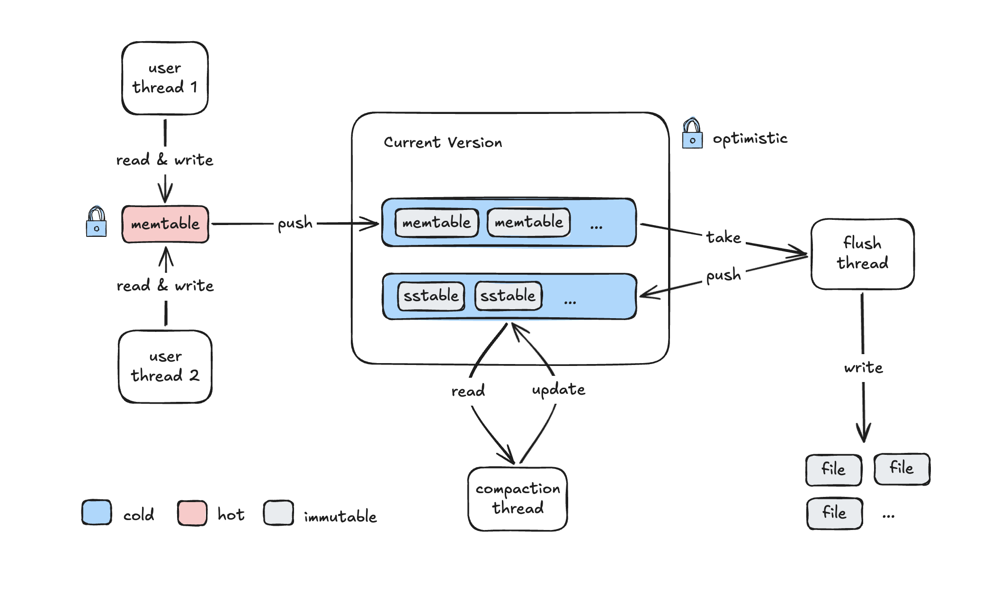

# MossDB




- [ ] update the final architechture
- [ ] the current arch
- [ ] road map & todos

## Architecture

- engine
  - memtable
  - version
    - immutable memtables
    - sstables
      - sparse index
      - cached reader
- flush
- compact
- sstable files
  - block based
- metadata

## Usage

- put
- get
- del
- flush
- dump

- repl
- library
- multiple thread

- [x] memtable
- [x] sstable
- [x] multi-threaded read and write
- [x] flush thread
- [x] compaction thread
- [ ] write ahead log
- [ ] test

## Integration Test

```sh
cargo test -v --test integration_test -- --show-output --test-threads=1
```
