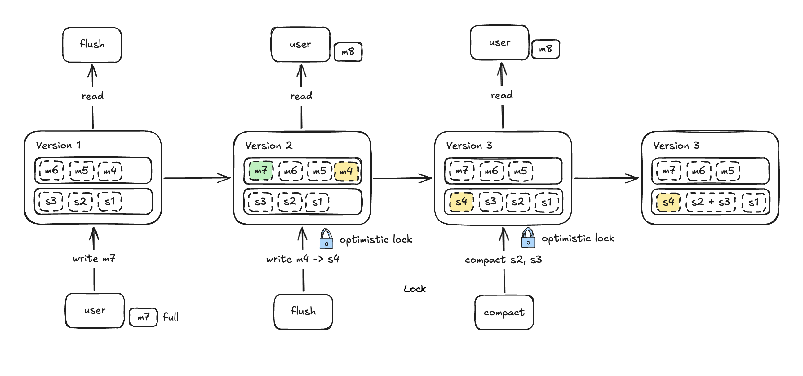
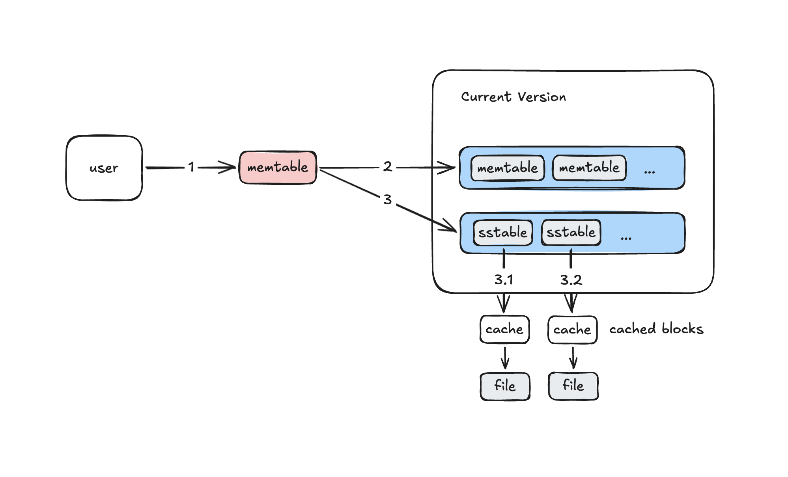
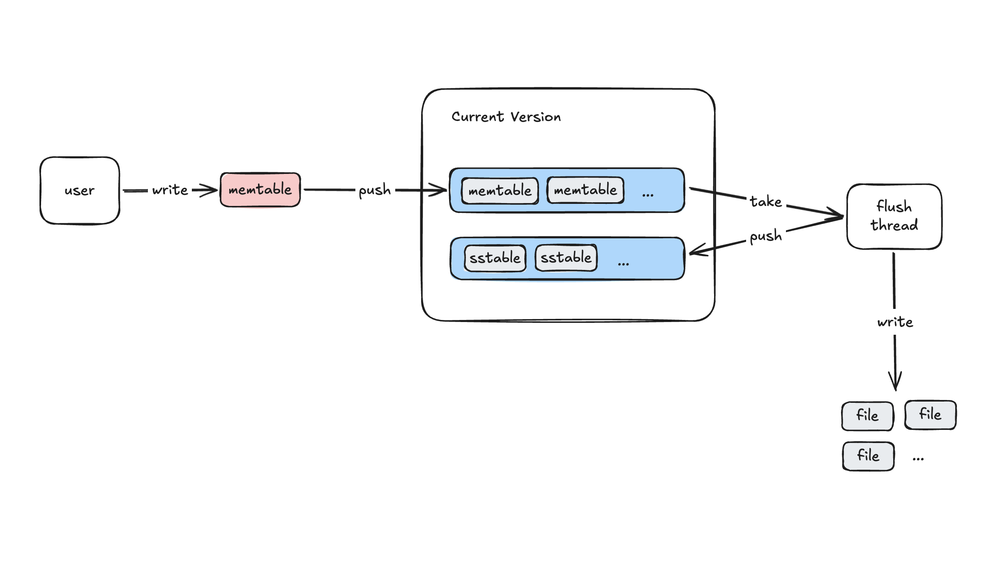

# MossDB


An LSM-based key-value storage library, aimed to be used as an embedded storage engine, supporting multi-threaded reads and writes, and providing high write throughput by utilizing the disk's high-speed sequential write.

_This project is built for learning, not intended for use in production._

## Usage

```rust
// initialize the Engine
// with current path as the log storage
// memtable max 64 MB before flush
// max 10 sstable log files
let e = Engine::new("./", 64 * 1024 * 1024, 10).unwrap();

// put a key value
e.put("1", "1");

// get a key
let res = e.get("1").unwrap();
assert_eq!("1", res);

// delete a key
e.del("1");

// get a non-exist key returns an Err
let res = e.get("1");
assert!(res.is_err_and(|e| e == MossError::KeyNotFound));
```

## Architecture


**Engine**: interface, providing put, get, del methods, owns a memtable and current version

**Memtable**: read and write

**Version**: immutable snapshot of a consistent system state, owns immutable memtables and sstables

**Sstable**: representation of disk log files, has a sparse index and cached reader

**Sparse index**: key -> block start offset

**Cached reader**: caches recently accessed blocks

**Flush thread**: flushes immutable memtables to sstable files, generates a new version

**Compact thread**: compacts sstable files, generates a new version

**Sstable files**: block-based, format: sparse index start, data block start, sparse index blocks, data blocks

**Metadata file**: persists the order of sstable files

## Detail

### Version



Version contains a consistent snapshot of system state, including an immutable memtable queue and an sstable queue.

Flush thread and compact thread read the current version and generate a new version from it, then use an optimistic lock (compare and set) to try installing the newest version.

Since version installation is relatively rare compared to user read and write, an optimistic lock is performant enough.

### Read path



### Write path



### Multi-threading Performance

The hot memtable is currently guarded by a Mutex, which means reads and writes need to first acquire the lock. If there are multiple user threads that read and write concurrently, it may decrease performance.

For flush and compact threads, as mentioned before, the optimistic lock is performant enough.

So the best use case is to use a small number of read/write threads for better performance.

### Arc and File Deletion

Each SSTable represents a file on disk. An SSTable is wrapped with an `Arc`, and it may be shared by some version, flush thread, compact thread, or user read. When the reference count decreases to zero, which means the file is no longer needed, the file will be deleted.

## Integration Test

```sh
cargo test -v --test integration_test -- --show-output --test-threads=1
```

## Roadmap

- [x] memtable
- [x] sstable
- [x] multi-threaded read and write
- [x] flush thread
- [x] compaction thread
- [ ] write ahead log
